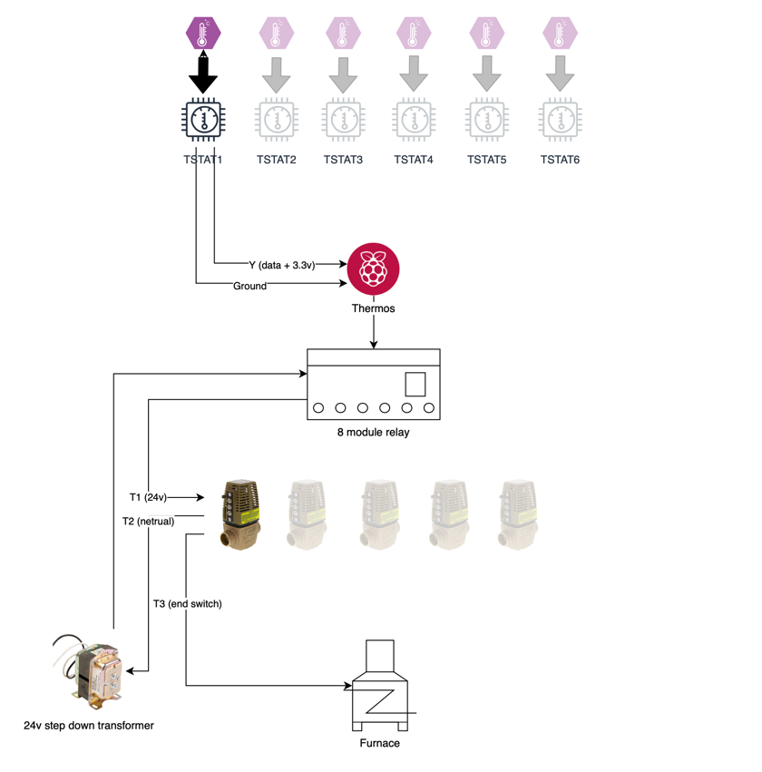

# Thermos
## HomeKit Thermostat for Hydronic Heating Systems

Thermos is a HomeKit thermostat designed for multi-zone hydronic heating systems

## Benefits:
* You only need one Thermos to control all of your heating system's zone valves
* Much cheaper than using smart thermostats for every single zone/thermostat in your home
* No need to worry if you have a common wire in your wall or not.. Thermos can use your existing wires!

## Usage

`docker-compose up -d`

## System Design

